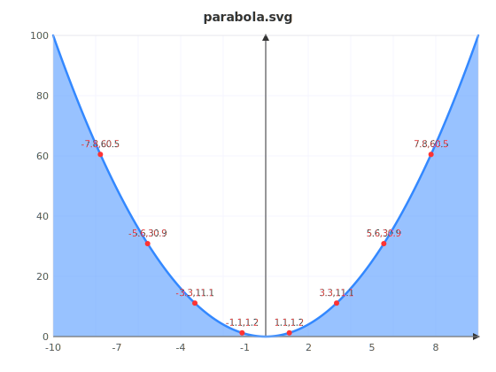

# 🥥 തേങ്ങC / ThengaC Compiler  🇮🇳

[](LICENSE)
[](https://github.com)
[](https://github.com)
[](https://llvm.org)

---

## Table of Contents
1. [Overview](#overview)
2. [Access & Licensing](#access--licensing)
3. [Quick Links](#-quick-links)
4. [Special Purpose & Features](#special-purpose--features)
5. [How It Works](#how-it-works)
6. [Keywords & Language Syntax](#keywords--language-syntax)
7. [Core Functions](#core-functions)
8. [Prerequisites](#prerequisites)
9. [Build & Installation](#build--installation)
10. [Usage Examples](#usage-examples)
11. [Project Structure](#project-structure)
12. [Contributing](#contributing)

---

## Overview

**തേങ്ങC / ThengaC** is a specialized compiler designed for mathematical curve analysis and visualization. It compiles a custom programming language featuring **Malayalam-inspired syntax** into machine-executable code via LLVM IR (Intermediate Representation).

**Project Status:** 🟢 Active Development (v0.1.0)

**Creator:** Nidhin M Mohan

**Repository Type:** Private (Granted Access Only)

---

## Access & Licensing

### Repository Access
⚠️ **This is a PRIVATE repository.** Only individuals with explicit access permissions can clone, view, or modify this project.

**Access Request:** Contact the project maintainer for access credentials.

### Copyright & License Notice

```
Copyright © 2026 Nidhin M Mohan (All Rights Reserved)
ThengaC Compiler - Mathematical Analysis & Visualization Tool

This software is proprietary and confidential. Unauthorized copying,
modification, distribution, or use of this code is strictly prohibited.

All intellectual property rights are reserved by the copyright holder.
```

**Usage Terms:**
- ✅ Authorized users may use this software for personal purposes
- ❌ Redistribution without explicit written permission is prohibited
- ❌ Reverse engineering or decompilation is not allowed
- ✅ Modifications are allowed only for authorized contributors with proper attribution

---

## 🔗 Quick Links

- 🔒 [Private Repo](https://github.com/ThengaC/ThengaC---Private) — Source & tests
- 📧 Contact — For access requests
- 💡 Ideas — Discuss in private repo

---

## Special Purpose & Features

ThengaC is **NOT a general-purpose programming language**. It is purpose-built for:

### 🎯 Core Use Cases
1. **Mathematical Function Definition** — Define curves using intuitive `curve` keyword
2. **Automatic Graph Generation** — Export publication-ready SVG graphs with `graph_undakk`
3. **Calculus Operations** — Built-in integration (`curve_parapp`) and differentiation (`cherivu`)
4. **Real-time Visualization** — Plot curves and analyze mathematical properties instantly

### 🔧 Specialized Capabilities
- **LLVM-Backed Compilation** — Native code generation for performance
- **Curve Analysis Engine** — Simpson's Rule integration, numerical differentiation
- **Multi-curve Support** — Define and work with multiple mathematical functions
- **SVG Export** — High-quality graph visualization with configurable bounds

---

## How It Works

### Frontend Architecture

```
┌─────────────────┐
│  ThengaC Code   │
│  (.tc file)     │
└────────┬────────┘
         │
         ▼
┌─────────────────────┐
│  Lexer/Tokenizer    │ -> Converts Malayalam keywords to tokens
│  (thengac_main.cpp) │
└────────┬────────────┘
         │
         ▼
┌─────────────────────┐
│  Parser/AST Builder │  -> Builds Abstract Syntax Tree
│  (Grammar Analysis) │
└────────┬────────────┘
         │
         ▼
┌──────────────────────────┐
│  LLVM IR Codegen         │  -> Generates LLVM Intermediate Representation
│  (llvm::Module builder)  │
└────────┬─────────────────┘
         │
         ▼
┌──────────────────────────┐
│  LLVM Compilation        │  -> Optimizes & compiles to machine code
│  (llvm::TargetMachine)   │
└────────┬─────────────────┘
         │
         ▼
┌──────────────────────────┐
│  Executable + Graphics   │  -> Native binary + SVG graphs
│  (.o file + .svg files)  │
└──────────────────────────┘
```

### Compilation Flow

1. **Lexical Analysis** — Source code tokenized using Malayalam keyword mappings
2. **Syntactic Analysis** — Tokens parsed into AST (Abstract Syntax Tree)
3. **Semantic Analysis** — Type checking and symbol table construction
4. **Code Generation** — LLVM IR emitted from AST
5. **Optimization** — LLVM middle-end optimizations applied
6. **Linking** — Runtime library (`thenga_runtime.c`) linked with generated code
7. **Execution** — Binary runs and generates output + graphs

---

## Keywords & Language Syntax

### Language Keywords

| Malayalam Keyword | English Meaning | Purpose |
|-------------------|-----------------|---------|
| `pani` | Function | Declare a function |
| `parayeda` | Print/Tell | Output values to console |
| `undakk` | Let/Declare | Variable declaration |
| `enkil` | If | Conditional branching |
| `allenkil` | Else | Alternative branch |
| `karangi` / `karangu` | While | Loop construct |
| `sathyam` | True | Boolean literal |
| `thallu` | False | Boolean literal |
| `thirichayakk` | Return | Return from function |
| `curve` | Curve | Mathematical function definition ⭐ |
| `graph_undakk` | Graph Export | SVG plot generation ⭐ |
| `curve_parapp` | Integration | Area under curve (calculus) |
| `cherivu` | Differentiation | Slope/derivative at point |

### Example Syntax

```thenga
# --- Curve definitions ---
curve parabola(x)
    thirichayakk x * x;

# --- Normal function ---
pani add(a, b) {
    thirichayakk a + b;
}

# --- Main program ---
pani main() {
 # x-range only: auto-scale y (will include origin because of auto policy)

    graph_undakk(parabola, -10, 10, "parabola.svg");   # passing function names to graph_undakk
                                                        # like, function pointers in C,  
                                                        # but more direct and easy to use 

    # Integration — area under curves
    undakk area_parabola = curve_parapp(parabola, 0, 10);
    parayeda("0 to 10 nu idayilulla parabola yude area :");
    parayeda(area_parabola);
    parayeda("Sum : (7, 8) result:");
    enkil (100 > 10) {
        parayeda("sheri");
    }
    allenkil {
        parayeda("thett");
    }
    thirichayakk 0;     
}
```

---

## Core Functions

### `graph_undakk` — invocation forms and behavior

**Purpose:** Export a mathematical curve as an SVG graph. `graph_undakk` supports multiple calling forms to make plotting flexible for different use-cases (auto-scaling, fixed boxes, and sentinel rules).

Supported invocation forms (examples from `test/test.tc`):

1) x-range only — auto-scale Y (include origin if needed)

```thenga
graph_undakk(parabola, -10, 10, "parabola2.svg");
```

- Behavior: You supply only `x_min` and `x_max`. The renderer samples the curve across that X range and automatically chooses a Y range to fit the data. By default the auto-scaling policy will include the origin (0,0) when appropriate so axes look consistent.

2) explicit box — fixed X and Y bounds

```thenga
graph_undakk(parabola, -10, -25, 10, 100, "parabola_box.svg");
```

- Behavior: You supply `x1, y1, x2, y2` to fix the plotting rectangle. This forces the same view regardless of the curve's sampled values (useful for comparing multiple curves on the same axes).

3) sentinel form — auto-scale but ensure the origin is visible

```thenga
graph_undakk(parabola, -10, 0, 10, 0, "parabola_origin.svg");
```

- Behavior: Passing `0` for `y1` and `y2` is treated as a sentinel that requests automatic Y scaling while guaranteeing that the origin `(0,0)` remains visible inside the plot. Use this when you want auto-scaling but need the axes to include the origin for readability or comparisons.

Notes and file-name parameter

- The final string parameter is the output filename. If omitted a default name is chosen (implementation-dependent); supplying a filename is recommended.
- The function accepts curve identifiers (e.g. `parabola`, `cubic`) directly — think of them like function pointers.
- Sampling resolution, gridlines, axis labeling, and SVG styling are controlled by the runtime; adjust those settings in the runtime or add CLI flags if/when available.

Recommended usage patterns

- Quick visual checks: use the x-range form.
- Side-by-side comparisons: use explicit box with identical bounds for all curves.
- Publication-friendly plots where the origin must be shown: use sentinel form with `0` Y bounds.

Example mapping to `test/test.tc`:

- `graph_undakk(parabola, -10, 10, "parabola2.svg")` → auto Y with origin policy
- `graph_undakk(parabola, -10, -25, 10, 100, "parabola_box.svg")` → fixed box
- `graph_undakk(parabola, -10, 0, 10, 0, "parabola_origin.svg")` → auto Y but ensure origin

**Generated Output:** `quadratic.svg` in current directory

---

### Integration: `curve_parapp(curve, a, b)`

**Purpose:** Calculate area under a curve using Simpson's Rule (numerical integration).

**Method:** Simpson's Rule approximation
$$\int_a^b f(x)\,dx \approx \frac{h}{3}[f(a) + 4f(x_1) + 2f(x_2) + 4f(x_3) + \ldots + f(b)]$$

where $h = \frac{b-a}{n}$ and $n$ is the number of intervals.

**Example:**
```
undakk area_parabola = curve_parapp(parabola, 0, 10);
parayeda("0 to 10 nu idayilulla parabola yude area :");
parayeda(area_parabola);
```

---

### Differentiation: `cherivu(curve, x, h)`

**Purpose:** Compute numerical derivative (slope) at a point using central difference.

**Method:** Central Difference Formula
$$f'(x) \approx \frac{f(x+h) - f(x-h)}{2h}$$

**Example:**
```
undakk slope_parabola = cherivu(parabola, 3);
parayeda("0 to 10 nu idayilulla parabola yude slope :");
parayeda(slope_parabola);
```
### **Sample Example:**
```
# --- Curve definitions ---
curve parabola(x)
    thirichayakk x * x;

# --- Main program ---
pani main() {

    graph_undakk(parabola, -10, 10, "parabola.svg"); 

    # Integration — area under curves
    undakk area_parabola = curve_parapp(parabola, 0, 10);
    parayeda("0 to 10 nu idayilulla parabola yude area :");
    parayeda(area_parabola);

    thirichayakk 0;
}
```
#### **Output:**
```
Graph  save ചെയ്തു -->  parabola.svg  (browser - ൽ തുറക്ക് !)
0 to 10 nu idayilulla parabola yude area :
333

```
#### **Generated SVG :**  
<p align="center">
  
</p>

---

## Prerequisites

### System Requirements
- **OS:** Linux (tested on Ubuntu 20.04+)
- **Architecture:** x86_64 or ARM64
- **RAM:** Minimum 2GB (4GB recommended)

### Required Dependencies
- **C++ Compiler:** GCC 9+ or Clang 11+
- **LLVM:** Version 14.0+ (development libraries)
- **Build Tools:** shell/bash, `llvm-config`, and standard system tools
- **Standard Libraries:** glibc, libmath

### Installation Commands

#### Ubuntu/Debian
```bash
sudo apt-get update
sudo apt-get install -y build-essential
sudo apt-get install -y llvm-14 llvm-14-dev
sudo apt-get install -y clang-14
```

### Verify Installation
```bash
llvm-config --version
clang++ --version
```

---

## Build & Installation

### Step 1: Clone Repository (Authorized Users Only)

```bash
git clone https://github.com/your-org/thengaC.git
cd thengaC
```

### Step 2: Build the Compiler

#### Option A: Using the provided build script (Recommended)
```bash
cd test/
chmod +x build.sh
./build.sh
```

This script compiles `thengac_main.cpp`, builds the runtime object, generates LLVM IR from a `.tc` test file, links the executable, and runs it.

#### Option B: Manual Compilation
```bash
cd test/
clang++ ../source/thengac_main.cpp \
    `llvm-config --cxxflags | sed 's/-Wno-maybe-uninitialized//'` \
    `llvm-config --ldflags --system-libs --libs core` \
    -std=c++14 -O2 -o thengac

# Compile runtime
clang -c ../source/thenga_runtime.c -o thenga_runtime.o

# Generate LLVM IR from a source file
./thengac ${1:-test.tc} > out.ll 2>err.log

# Link executable
clang out.ll thenga_runtime.o -o thenga_out -Wno-override-module

# Run
./thenga_out
```

---

## Usage Examples

### Example 1: Arithmetic Operations

**File: `add_demo.tc`**
```
pani add(a, b) {
    thirichayakk a + b;
}

pani main() {  
    undakk total = add(7, 8);
    parayeda("Sum : (7, 8) result:");
    parayeda(total);
    thirichayakk 0;
}
```

**Output:**
```
Sum : (7, 8) result:
15
```

---

### Example 2: Conditional Logic operations

**File: `if_else.tc`**
```
pani main() {
    undakk total = 200;
    enkil (total > 10) {
        parayeda("nee oru mandana !!");
    }
    allenkil {
        parayeda("nee oru buddhimaan !!");
    }
    thirichayakk 0;
}
```
**Output:**
```
nee oru mandana !!
```

## Project Structure
```
thengaC/
├── ThengaC---Public                      # This is a public repo
│        ├── LICENCE                      # Project LICENSE
│        ├── README.md                    # README file
│        ├── .git/                        # Git repository metadata
│        └── parabola.svg                 # Generated SVG result
└── ThengaC---Private                     # This is a private repo
         ├── source/                      # Compiler source code
         │   ├── .git/                    # Git repository metadata
         │   ├── thengac_main.cpp         # Main compiler (lexer, parser, codegen)
         │   └── thenga_runtime.c         # Runtime library (printf, math functions)
         │
         └── test/                        # Test suite & examples
             ├── test.tc                  # Comprehensive feature test
             └── build.sh                 # Build script for tests

```

---

## Contributing

### For Authorized Collaborators Only

1. **Create a Feature Branch**
   ```bash
   git checkout -b feature/your-feature-name
   ```

2. **Make Changes**
   - Follow the existing code style (LLVM C++ conventions)
   - Add tests in `test/` directory
   - Update this README if adding new keywords/features

4. **Submit Pull Request**
   - Provide detailed description of changes
   - Reference any related issues
   - Ensure CI/CD checks pass

### Code Style Guidelines
- **C++:** LLVM naming conventions (CamelCase for classes, camelCase for functions)
- **Comments:** Use `#` for Commenting lines
- **Indentation:** 4 spaces (no tabs)
- **Keywords:** Update enum Token{} when adding new language keywords

---

## Known Limitations & Future Work

### Current Limitations
- ⚠️ Single-file compilation only (no module system yet)
- ⚠️ Limited type system (integer & string primarily)
- ⚠️ No floating-point support (planned)
- ⚠️ Graph resolution fixed at 1000 samples

### Planned Features (v0.2.0+)
- 🔜 Function composition (`curve_compose`)
- 🔜 Floating-point number type
- 🔜 Array/List data structure
- 🔜 File I/O operations
- 🔜 Interactive mode (REPL)


---

## Troubleshooting

### Build Errors

**Error: `llvm-config: command not found`**
```bash
# Install LLVM development files
sudo apt-get install llvm-14-dev
```

**Error: `fatal error: 'llvm/IR/Module.h': No such file or directory`**
```bash
# Reinstall LLVM headers
sudo apt-get install --reinstall llvm-14-dev
```

### Runtime Errors

**No `.svg` files generated:**
- Check file write permissions in current directory
- Ensure `graph_undakk` is called with valid curve name
- Verify x_min < x_max

**Segmentation Fault:**
- Ensure curves are defined before use
- Check variable initialization before access

---

## Performance Benchmarks

| Operation | Input Size | Time (ms) | Notes |
|-----------|-----------|----------|-------|
| Compile simple curve | 10 lines | ~50 | Includes LLVM codegen |
| Graph export | 1 curve | ~100 | 1000-point sample |
| Integration (Simpson's) | 10000 intervals | ~30 | Numerical approximation |
| Differentiation | Single point | <1 | Central difference method |

---

## Support & Contact

📧 **Maintainer:** Nidhin M Mohan

🔐 **Access Requests:** Contact maintainer directly

💡 **Feature Requests:** Discuss in pull requests  

---

## Changelog

### v0.1.0 (Current Release)
- ✅ Lexer & Parser implementation
- ✅ LLVM IR code generation
- ✅ Basic curve definition & plotting
- ✅ Simpson's Rule integration
- ✅ Central difference differentiation
- ✅ SVG graph export

### v0.0.1 (Initial Prototype)
- Language design & specification
- Basic compiler skeleton

---

## License

```
Proprietary & Confidential
Copyright © 2026 Nidhin M Mohan

All Rights Reserved.
Unauthorized reproduction strictly prohibited.
```

See [LICENSE](LICENSE) file for complete terms.

---

<div align="center">

**Made with ❤️ by Nidhin M Mohan**

[⬆ Back to Top](#thengac-compiler)

</div>
